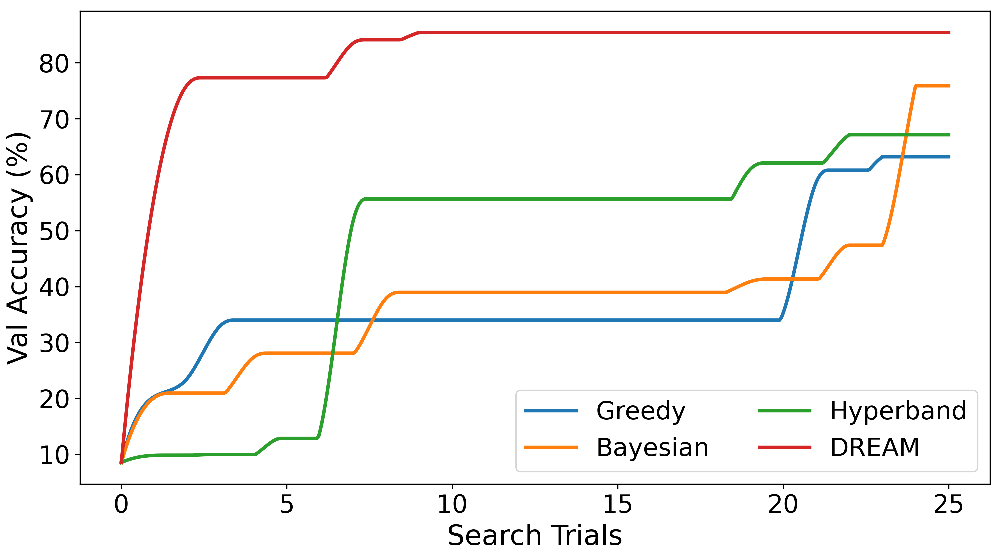

# DREAM

## TL;DR

An automatic debugging and repairing system for AutoML systems.
It monitors the process of AutoML to collect detailed feedback and automatically repairs bugs by expanding search space and leveraging a feedback-driven search strategy.
It focuses on the performance and ineffective search bugs.

*Our system is still a prototype, and we will continue to optimize and improve this system.*

## Repo Structure

```
- DREAM/                 
    - Autokeras/
    - Kerastuner/
    - Test_dir/  
        - demo_origin/
    - utils/         
    - initial_Dream.sh            
    - demo0.py   
    - replace.txt
    - requirements.txt               
- Motivation/                      
- SupplementalExperimentResults/                      
    - RQ1-Figure/
    - reproduct_models_from_parameters/
    - PriorityTable.tsv
- README.md

```

## Setup
DREAM is implemented on Python 3.7.7, TensorFlow 2.4.3, and AutoKeras 1.0.12.
To install all dependencies, please get into this directory and run the following command.
It is worthy to notice that TensorFlow may have compatibility problems on different versions.
**Please make sure the version of TensorFlow is 2.4.3** after installation.

```bash
$ pip install-r requirements.txt
```

After installing TensorFlow and AutoKeras, use the following command to install the DREAM in AutoKeras.
As shown in the 3rd line, `initial_Dream.sh` need the site-package dir and the python path as inputs.

```bash
$ cd ./DREAM
$ chmod +x ./initial_Dream.sh
$ ./initial_Dream.sh /xxx/envs/env_name/lib/python3.7/site-packages /xxx/envs/env_name/bin/python
```

The current version of DREAM will substitute the Greedy search strategy in AutoKeras. 
We're not sure if the code of the search strategies in AutoKeras potentially conflicts with DREAM.
Therefore we suggest that if you still want to use the unrepaired search of AutoKeras, you could make a backup for the original AutoKeras and Kerastuner lib before installing DREAM, or you could refer to the [anaconda doc](https://docs.conda.io/projects/conda/en/latest/user-guide/tasks/manage-environments.html) to clone the same environment with original AutoKeras.
**In the future, we will continue to improve the DREAM to avoid conflicts between the search strategies.**


## Usage
It is easy to use *DREAM* to repair the AutoML pipeline and conduct effective searches. 
When the environment configuration in `Setup` is finished, you can use *DREAM* to search models directly by using `greedy` tuner in `autokeras.ImageClassifier()`.
To show our method intuitively, we provide a demo case in [demo.py](./DREAM/demo0.py), which is based on the CIFAR-100 dataset.
You can just run [demo.py](./DREAM/demo0.py) to see how *DREAM* search models with the expanded search space and feedback-driven search.
In addition, you can also specify the parameters in this code to customize the search process. We have made some necessary comments on the code for easy understanding.

``` bash
$ $ cd ./DREAM
$ python demo.py
```

If you want to use other datasets (e.g., Food-101 and Stanford Cars in our experiment), you can use `tensorflow_datasets` to load the dataset, refering to [this doc](https://www.tensorflow.org/datasets/api_docs/python/tfds/load). For the TinyImagenet dataset in our experiments, we use the loader from this [repo](https://github.com/ksachdeva/tiny-imagenet-tfds).
The loaders of these three datasets are in the [demo.py](./DREAM/demo0.py).
When you have downloaded the dataset, you need to assign the `data_dir` in the loader to your dataset path and choose the `data` in the 'argparse' before searching.

## Experiment Results

### RQ1-Figure

To evaluate the effectiveness of DREAM in fixing the AutoML in- effective search bug and performance bug, we conduct comparative experiments with a total of fifteen searches on four datasets with each search strategy (i.e., three baseline strategies in AutoKeras and the repaired search in DREAM).
In this experiment, we observe whether DREAM can effectively repair the bugs in the AutoML pipeline and guide the search to perform better and more effectively, and the results are shown in this [directory](./SupplementalExperimentResults/RQ1-Figure).

The results show that *DREAM* is effective in repairing the performance and ineffective search bugs of the AutoML pipeline.
*DREAM* achieves an average score of 83.00% on four datasets within 25 trials, which is significantly better than the score of other baselines (i.e., 51.51% in Greedy, 54.13% in Bayesian, and 52.38% in Hyperband).
And all searches in DREAM take an average of 10.06 hours to reach the target accuracy of 70% on four datasets.
In contrast, only two-fifth of the searches in the AutoKeras pipeline achieve the search target within 24 hours.
These results show the effectiveness of *DREAM* in repairing the AutoML bugs.

The following two figures show the effectiveness of DREAM in repairing the performance bug on the Food-101 dataset and repairing the ineffective search bug on the TinyImagenest dataset, respectively.





## Reproduction

Our experiment results on four datasets are saved in [here](xxxx).
Detailed descriptions about the results are shown in the `ReadMe.md` in the zip file in the above [link](xxx).

The full table of the priority of search actions are shown in [here](./SupplementalExperimentResults/PriorityTable.tsv)
In addition, the search results of two cases in Motivation are also shown in [`Motivation`](./Motivation).
The `log.pkl` contains the search history of each strategy, and the `best_param.pkl` stores the best model architecture in each search.
If you want to reproduce the DREAM search in Motivation, you can use the [demo file](./DREAM/demo0.py) to load the `param_SearchSeed.pkl` as the initial architecture `args.origin_path` in search.


If you want to reproduce our experiment, you can use the [demo.py](./DREAM/demo0.py) directly.
It is worth mentioning that you need to use `-op` to assign the initial model architecture as the beginning of the search.
The result will be saved in this [directory](./DREAM/Test_dir/demo_result) and the [log](./DREAM/Test_dir/demo_result/log.pkl) will also save there.