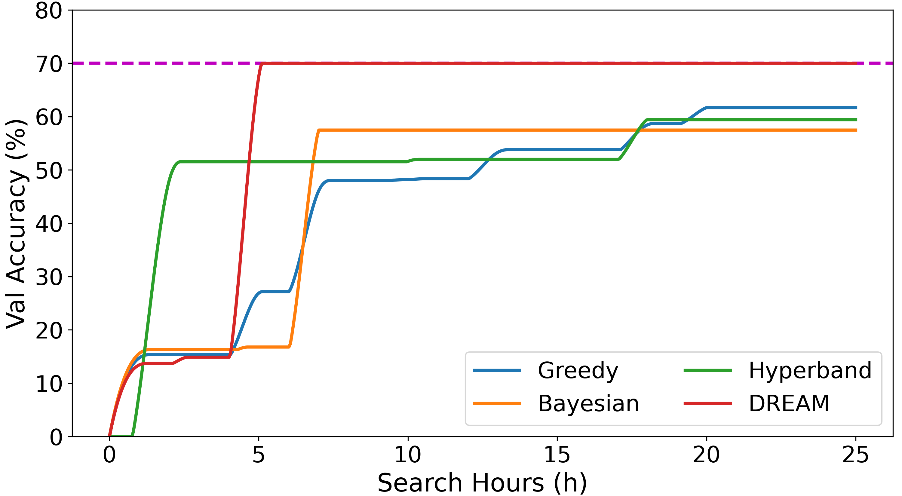
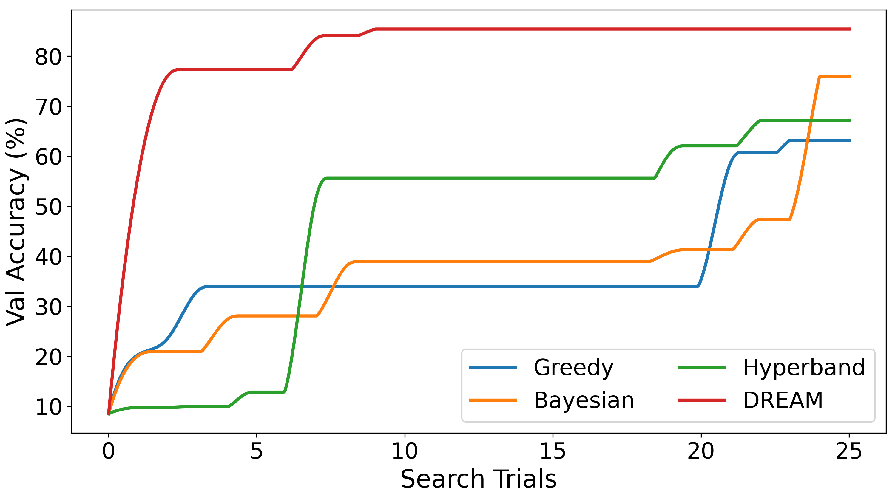

# DREAM

## TL;DR

A model search method guided by internal training feedback that aims to conduct an effective search and improve the search performance.
It collects the detailed feedback from the model training process and selects the search actions on the expanding search space based on the feedback and the pre-built search action distribution of search actions.

*Our system is still a prototype, and we will continue to optimize and improve this system.*

## Repo Structure

```
- DREAM/                 
    - Autokeras/
    - Kerastuner/
    - Test_dir/  
        - demo_origin/
    - utils/         
    - initial_Dream.sh     
    - backup_reset.sh       
    - demo0.py   
    - test_run_autokeras.py
    - replace.txt
    - requirements.txt               
- Motivation/                      
- SupplementalExperimentResults/   
    - load_param4autokeras                   
    - Experiment-Figure/
    - reproduct_models_from_parameters/
    - PriorityTable.md
    - ActionTable.md
- README.md
```


## Setup
DREAM is implemented on Python 3.7.7, TensorFlow 2.4.3, and AutoKeras 1.0.12.
To install all dependencies, please get into this directory and run the following command.
It is worthy to notice that TensorFlow may have compatibility problems on different versions.
**Please make sure the version of TensorFlow is 2.4.3** after installation.

```bash
$ pip install keras-tuner==1.0.2 keras==2.3.1 tensorflow==2.4.3 autokeras==1.0.12 tensorflow_datasets==2.1.0 matplotlib==3.3.0
$ # OR pip install -r requirements.txt
```

After installing TensorFlow and AutoKeras, use the following command to install the DREAM in AutoKeras.
The [`backup_reset.sh`](./DREAM/backup_reset.sh) will make a backup for the original AutoKeras and KerasTuner libs when first used.
Calling this script later will use the backup libs to restore to eliminate the impact of the modified code.
The script `initial_Dream.sh` will implement `DREAM` based on the original AutoKeras and KerasTuner libs.
As shown in the 4th line, `initial_Dream.sh` need the site-package dir and the python path as inputs.

```bash
$ cd ./DREAM
$ chmod +x ./initial_Dream.sh
$ ./backup_reset.sh /xxx/envs/env_name/lib/python3.7/site-packages
$ ./initial_Dream.sh /xxx/envs/env_name/lib/python3.7/site-packages /xxx/envs/env_name/bin/python
```

The current version of DREAM will substitute the Greedy search strategy in AutoKeras. 
We are not sure whether the code of the search strategies in AutoKeras potentially conflicts with DREAM.
Therefore we suggest that if you still want to use the search methods of AutoKeras, you could use `backup_reset.sh` to make a backup for the original AutoKeras and Kerastuner lib before installing DREAM, or you could refer to the [anaconda doc](https://docs.conda.io/projects/conda/en/latest/user-guide/tasks/manage-environments.html) to clone the same environment with original AutoKeras.
**In the future, we will continue to improve the DREAM to avoid conflicts between the search strategies.**


## Usage
It is easy to use *DREAM* to conduct effective searches. 
When the environment configuration in `Setup` is finished, you can use *DREAM* to search models directly by using `greedy` tuner in `autokeras.ImageClassifier()`.
To show our method intuitively, we provide a demo case in [demo.py](./DREAM/demo0.py), which is based on the CIFAR-100 dataset.
You can just run [demo.py](./DREAM/demo0.py) to see how *DREAM* search models with the expanded search space and search action distribution-driven search.
In addition, you can also specify the parameters in this code to customize the search process. We have made some necessary comments on the code for easy understanding.

``` bash
$ cd ./DREAM
$ python demo.py
```

When you want to use other datasets (e.g., Food-101 and Stanford Cars in our experiment), you can use `tensorflow_datasets` to load the dataset, referring to [this doc](https://www.tensorflow.org/datasets/api_docs/python/tfds/load). For the TinyImagenet dataset in our experiments, we use the loader from this [repo](https://github.com/ksachdeva/tiny-imagenet-tfds).
The loaders of these three datasets are in the [demo.py](./DREAM/demo0.py).
When you have downloaded the dataset, you need to assign the `data_dir` in the loader `tfds.load()` to your dataset path and use `-d` to assign the data type before searching.


## Experiment Results

### Experiment-Figure

To evaluate the effectiveness of *DREAM* in searching models on the given tasks, we conduct comparative experiments with a total of eighteen groups of searches on four datasets with each search strategy (i.e., three baseline strategies in AutoKeras and DREAM).
In this experiment, we observe whether DREAM can effectively guide the search to perform better, and the results are shown in this [directory](./SupplementalExperimentResults/Experiment-Figure).

The results show that *DREAM* is effective and efficient in searching models and achieve better performance than AutoKeras.
*DREAM* achieves an average score of 83.21% on four datasets within 25 trials, which is significantly better than the score of other baselines (i.e., 51.11% in Greedy, 54.66% in Bayesian, and 50.47% in Hyperband).
And all searches in *DREAM* take an average of 7.94 hours to reach the target accuracy of 70% on four datasets.
In contrast, only 20/54 of the searches in the AutoKeras system achieve the search target within 24 hours.
These results show the effectiveness of *DREAM* in searching well-performance models for the given tasks.

The following two figures show the effectiveness of *DREAM* on the Food-101 dataset and TinyImagenest dataset, respectively.






## Reproduction

Our experiment results on four datasets are saved in [here](https://drive.google.com/file/d/10OZVaFdjP387ACl_1BDaP9AEjD3w_YX2/view?usp=sharing).
Since the maximum model in our search is close to 1 GB, and our experiments search hundreds of models, which may bring a large amount of data, we only reserve part of the sample models for display, and most of the models only reserved the corresponding architectures and hyperparameters.
You can refer to this [code](./SupplementalExperimentResults/reproduct_models_from_parameters/reproduce_experiment_model.py) to load and restore these models from the `param.pkl`.
Detailed descriptions of the results are shown in the `ReadMe.md` in the zip file in the above [link](https://drive.google.com/file/d/10OZVaFdjP387ACl_1BDaP9AEjD3w_YX2/view?usp=sharing).

The full table of the priority of search actions is shown in [here](./SupplementalExperimentResults/PriorityTable.md), and the full table of the search actions is shown in [this table](./SupplementalExperimentResults/ActionTable.md).

In addition, the search results of two cases in Motivation are also shown in [`Motivation`](./Motivation).
The `log.pkl` contains the search history of each strategy, and the `best_param.pkl` stores the best model architecture in each search.
If you want to reproduce the DREAM search in Motivation, you can use the [demo file](./DREAM/demo0.py) to load the `param_initial.pkl` as the initial architecture `args.origin_path` to start the search.


If you want to reproduce our experiment, you can also use the [demo.py](./DREAM/demo0.py) directly to reproduce the searches of `DREAM`.
It is worth mentioning that you need to use `-op` to assign the initial model architecture which is the beginning of the search.
The result will be saved in this [directory](./DREAM/Test_dir/demo_result) and the [log](./DREAM/Test_dir/demo_result/log.pkl) will also save there.
If you want to conduct comparison experiments with AutoKeras methods, you need to use [`backup_reset.sh`](./DREAM/backup_reset.sh) to restore the original AutoKeras library, and then use the [`replace_file.sh`](./SupplementalExperimentResults/load_param4autokeras/replace_file.sh) to modify the library to load the initial parameter and record the search logs, as shown below.


```bash
$ cd ./DREAM
$ ./backup_reset.sh /xxx/envs/env_name/lib/python3.7/site-packages
$ cd ../SupplementalExperimentResults/load_param4autokeras
$ ./replace_file.sh /xxx/envs/env_name/lib/python3.7/site-packages
```

After completing the environment configuration, you can use [`test_run_autokeras.py`](./DREAM/test_run_autokeras.py) to reproduce the experimental results and search process of the three search strategies of AutoKeras, shown as follows.

```bash
$ cd ./DREAM
$ python test_run_autokeras.py -d cifar100 -tn greedy
```

The `-tn` can assign the search strategies (i.e., greedy, bayesian, hyperband) in AutoKeras, and `-op` assigns the initial model architecture as the beginning of the search.
Due to the inevitable random variables in the search strategies, we cannot guarantee that the search results are completely consistent with our experimental results, but this random factor will not affect the effectiveness of DREAM in searching models.
