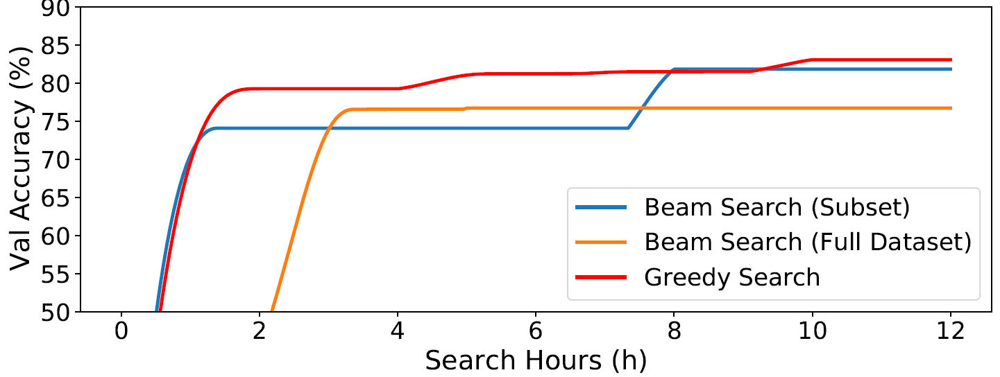

# DREAM

## TL;DR

An automatic debugging and repairing system for AutoML systems.
It monitors the process of AutoML to collect detailed feedback and automatically repairs bugs by expanding search space and leveraging a feedback-driven search strategy.
It focuses on the performance and ineffective search bugs.

Due to space limitations, we provide an **Extented Report of DREAM** in this file to describe the details of the experiments in the Design section.

*Our system is still a prototype, and we will continue to optimize and improve this system.*

## Repo Structure

```
- DREAM/                 
    - Autokeras/
    - Kerastuner/
    - Test_dir/  
        - demo_origin/
    - utils/         
    - initial_Dream.sh     
    - backup_reset.sh       
    - demo0.py   
    - test_run_autokeras.py
    - replace.txt
    - requirements.txt               
- Motivation/                      
- SupplementalExperimentResults/   
    - load_param4autokeras                   
    - RQ1-Figure/
    - reproduct_models_from_parameters/
    - PriorityTable.md
    - ActionTable.md
- README.md

```

## Setup
DREAM is implemented on Python 3.7.7, TensorFlow 2.4.3, and AutoKeras 1.0.12.
To install all dependencies, please get into this directory and run the following command.
It is worthy to notice that TensorFlow may have compatibility problems on different versions.
**Please make sure the version of TensorFlow is 2.4.3** after installation.

```bash
$ pip install-r requirements.txt
```

After installing TensorFlow and AutoKeras, use the following command to install the DREAM in AutoKeras.
The [`backup_reset.sh`](./DREAM/backup_reset.sh) will make a backup for the original AutoKeras and KerasTuner libs when first used.
Calling this script later will use the backup libs to restore to eliminate the impact of the modified code.
The script `initial_Dream.sh` will implement `DREAM` based on the original AutoKeras and KerasTuner libs.
As shown in the 4th line, `initial_Dream.sh` need the site-package dir and the python path as inputs.

```bash
$ cd ./DREAM
$ chmod +x ./initial_Dream.sh
$ ./backup_reset.sh /xxx/envs/env_name/lib/python3.7/site-packages
$ ./initial_Dream.sh /xxx/envs/env_name/lib/python3.7/site-packages /xxx/envs/env_name/bin/python
```

The current version of DREAM will substitute the Greedy search strategy in AutoKeras. 
We are not sure whether the code of the search strategies in AutoKeras potentially conflicts with DREAM.
Therefore we suggest that if you still want to use the unrepaired search of AutoKeras, you could use `backup_reset.sh` to make a backup for the original AutoKeras and Kerastuner lib before installing DREAM, or you could refer to the [anaconda doc](https://docs.conda.io/projects/conda/en/latest/user-guide/tasks/manage-environments.html) to clone the same environment with original AutoKeras.
**In the future, we will continue to improve the DREAM to avoid conflicts between the search strategies.**


## Usage
It is easy to use *DREAM* to repair the AutoML pipeline and conduct effective searches. 
When the environment configuration in `Setup` is finished, you can use *DREAM* to search models directly by using `greedy` tuner in `autokeras.ImageClassifier()`.
To show our method intuitively, we provide a demo case in [demo.py](./DREAM/demo0.py), which is based on the CIFAR-100 dataset.
You can just run [demo.py](./DREAM/demo0.py) to see how *DREAM* search models with the expanded search space and feedback-driven search.
In addition, you can also specify the parameters in this code to customize the search process. We have made some necessary comments on the code for easy understanding.

``` bash
$ cd ./DREAM
$ python demo.py
```

When you want to use other datasets (e.g., Food-101 and Stanford Cars in our experiment), you can use `tensorflow_datasets` to load the dataset, referring to [this doc](https://www.tensorflow.org/datasets/api_docs/python/tfds/load). For the TinyImagenet dataset in our experiments, we use the loader from this [repo](https://github.com/ksachdeva/tiny-imagenet-tfds).
The loaders of these three datasets are in the [demo.py](./DREAM/demo0.py).
When you have downloaded the dataset, you need to assign the `data_dir` in the loader `tfds.load()` to your dataset path and use `-d` to assign the data type before searching.

## Expanded Report of DREAM

<details>
<summary> Detailed experiments and results, search priorities, and a feedback-driven search example</summary>

### The Detailed Experiment to Calculate Conditional Probability

Based on summarized observations from feedback data, DREAM selects an optimal action that is the most possible to improve the current search by calculating the conditional probability $\mathbb{P}(Action | A, C, G, W)$.
Although the existing studies have mentioned that several actions can improve the model performance in some situations, it is still difficult to directly measure the actual effect of each action under different conditions.

To solve this problem, we construct large-scale experiments to evaluate the search priority of each action under different conditions in the feedback-driven search.
We randomly generate and train 200 different models on two datasets (i.e., CIFAR-10, CIFAR-100) and record the conditions summarized from the feedback of these models.
We record the model accuracy in training as $Acc_{ori}$.
Next, we search all feasible actions on each model one by one and generate new models to evaluate these actions.
Each search action can be written as $O-V$, where $O$ represents an object such as model architecture or hyperparameter this action will change, and $V$ represents the newly assigned value of the object.
Then we train these new models and record accuracy as $Acc_{O-V}$.
All the training processes mentioned here include 15 epochs, and the batch size is 32.
After these training processes are finished, we calculate the change of accuracy from the pair $O-V$, which is written as
$\Delta Acc_{O-V} = Acc_{O-V}-Acc_{ori}$.
Finally, we calculate the conditional probability $\mathbb{P}(Action | A, C, G, W)$.
$$\mathbb{P}(Action | A, C, G, W) = \frac{\sum_{i = 0}^{n} \Delta Acc^{i}_{O-V}} {n} $$
where $n$ represents the amount of models under the same *A-C-G-W* condition.
Larger $\mathbb{P}(Action | A, C, G, W)$ means that the action with the object $O$ and value $V$ are more prioritized in search and have more possibility to improve the current search performance.
We implement these evaluated priorities as the default setting in the feedback-driven search to fix the AutoML pipeline and guide the pipeline to search effectively.
In each trial, we choose the action with the highest probability (under observed A-C-G-W) to help generate new models.
The whole priority table is shown [here](./SupplementalExperimentResults/PriorityTable.md).
In the table, the left side of the equal sign for each action is the object, that is, the hyperparameter or model architecture that will be changed, and the right side is the newly assigned value.


During the search, if the action with the highest priority has already been applied in the current model, the feedback-driven search will select the action with the next highest priority, and so on.
Additionally, it is worth mentioning that we have met 17 sets of *A-C-G-W* conditions in the evaluation of 200 models, which is not all the potential conditions.
For other conditions not triggered in experiments, we have manually analyzed and found that some conditions are too hard to coexist.
For instance, when the EW condition is met, the NaN weights will cause the model to not update properly in the backpropagation.
Therefore, the VG and EG conditions can't occur with EW at the same time.
For such conditions that are not covered in our search priority, DREAM will choose random actions in search.

### The Demo Case of Feedback-driven Search

Here is a demo case to illustrate how the feedback-driven search performs with the search priorities.


For the ``Model 1`` with an initial score of 0.52 and the conditions as ``OA-NC-NG-NW``, as shown in the 14th column of [the priority table](./SupplementalExperimentResults/PriorityTable.md), the action with the highest priority is ``block type=xception``, which means that the object in this action is ``block type`` and the new value for it is ``xception``.
This action will change the model architecture to \textit{XceptionNet}.
After applying this action and generating the ``Model 2``, the search score in training has increased to 0.78, and the conditions have turned to ``XA-NC-NG-NW``, whose priority is listed in the last line of [the priority table](./SupplementalExperimentResults/PriorityTable.md).
The action with the highest priority in current conditions is ``pretrained=True``.
However, when building ``Model 2``, the hyperparameter ``pretrained`` has already been set to ``True``.
Therefore, ``pretrained=True`` is skipped, and ``trainable=True``, which has the next highest priority under the conditions, is selected as the action for this search.
After applying this action, the score of ``Model 3`` increases to 0.83.
At this time, the current conditions keep ``XA-NC-NG-NW``, and the next action to be searched is ``imagenet size=True``.
The search process described above is highlighted in the above figure.
The feedback-driven search in DREAM selects the actions one by one based on the conditions and the built-in priorities until the search is terminated.

### Beam Search VS Greedy Search

The feedback-driven search in DREAM is an improved greedy search strategy.
Specifically, when searching for a new model, it picks the best performing model in the search history and modifies this model by selecting actions that are most likely to improve the model through the feedback-driven search.

In fact, beam search, which is a common heuristic greedy search strategy, can be an alternative search method in DREAM.
It builds the search tree with a breadth-first search over the search space and generates all successors of the states at each level of the tree and sorts them with their performance.
The number of the stored states is equal to the width of the beam, which means that the larger the beam width, the fewer states to prune and the higher the search overhead.
When the beam width is 1, the search process will be equivalent to the greedy search.
With the above properties, beam search can explore the search space by expanding the most promising results in a limited set and is widely used in NLP and speech recognition models to choose the best output.

To determine the actual effect of beam search as an alternative search method, we construct a comparative experiment on the CIFAR-100 dataset.
The experiment ensures that the search priority and search space of the two search strategies are consistent.
In order to control the overhead of beam search, the beam width is set to 3.
In addition, with the intention of improving the search efficiency of beam search and covering more possible models in search, we implement a two-step search.
In the first step, we train nine searched models with the highest priorities, which are generated from the previous search, on a 10\% subset of the CIFAR-100 dataset.
Then in the second step, three models with the best performance in the first step are reserved for the complete training.
In addition, in order to avoid beam search converging in local optimum, all hyperparameters in the models in searches have a chance of 0.01 to randomly mutate.



The above figure shows the comparison results of beam search and greedy search on the CIFAR-100 dataset, where the X-axis is the GPU hours spent in the search, and the Y-axis is the best validation accuracy the search reached.
We implement two kinds of beam search in the experiments, namely a search trained in two steps with a 10\% subset of the dataset as described above (i.e., `Beam Search (Subset)'), and a search trained directly on the full dataset without the subset (i.e., `Beam Search (Full Dataset)'). 
The experimental results demonstrate the superiority of greedy search in search efficiency and effectiveness.
From this figure, greedy search improves accuracy faster than beam search using subsets.
And beam search trained on the full dataset performs worst in these search methods.
We analyze the specific process of the search manually and find that the main reason for the performance difference is that the beam search trains more models, and most of them help little in improving the search performance.
This results in that the search efficiency of beam search is worse than that of greedy search in the case of the same search space and search priorities.
Even for the search that most of the models are training on the subset of the CIFAR-100 dataset, the time cost of beam search to reach 80\% accuracy is still nearly 6 hours higher than the time spent of greedy search due to the time overhead of training additional models.

Therefore, for the consideration of efficiency and effectiveness in search, we select the greedy method as the default strategy of the feedback-driven search.
We believe that beam search has the potential to achieve better results when computing resources are sufficient and training can be deployed in parallel.
It will be our future work to improve the effectiveness of the feedback-driven beam search. 


</details>

## Experiment Results

### RQ1-Figure

To evaluate the effectiveness of DREAM in fixing the AutoML ineffective search bug and performance bug, we conduct comparative experiments with a total of fifteen searches on four datasets with each search strategy (i.e., three baseline strategies in AutoKeras and the repaired search in DREAM).
In this experiment, we observe whether DREAM can effectively repair the bugs in the AutoML pipeline and guide the search to perform better and more effectively, and the results are shown in this [directory](./SupplementalExperimentResults/RQ1-Figure).

The results show that *DREAM* is effective in repairing the performance and ineffective search bugs of the AutoML pipeline.
*DREAM* achieves an average score of 83.00% on four datasets within 25 trials, which is significantly better than the score of other baselines (i.e., 51.51% in Greedy, 54.13% in Bayesian, and 52.38% in Hyperband).
And all searches in DREAM take an average of 10.06 hours to reach the target accuracy of 70% on four datasets.
In contrast, only two-fifth of the searches in the AutoKeras pipeline achieve the search target within 24 hours.
These results show the effectiveness of *DREAM* in repairing the AutoML bugs.

The following two figures show the effectiveness of DREAM in repairing the performance bug on the Food-101 dataset and repairing the ineffective search bug on the TinyImagenest dataset, respectively.


## Reproduction

Our experiment results on four datasets are saved in [here](xxxx).
Since the maximum model in our search is close to 1 GB, and our experiments search hundreds of models, which may bring a large amount of data, we only reserve part of the sample models for display, and most of the models only reserved the corresponding architectures and hyperparameters.
You can refer to this [code](./SupplementalExperimentResults/reproduct_models_from_parameters/reproduce_experiment_model.py) to load and restore these models from the `param.pkl`.
Detailed descriptions about the results are shown in the `ReadMe.md` in the zip file in the above [link](xxx).

The full table of the priority of search actions are shown in [here](./SupplementalExperimentResults/PriorityTable.md), and the full table of the search actions are shown as [this table](./SupplementalExperimentResults/ActionTable.md).

In addition, the search results of two cases in Motivation are also shown in [`Motivation`](./Motivation).
The `log.pkl` contains the search history of each strategy, and the `best_param.pkl` stores the best model architecture in each search.
If you want to reproduce the DREAM search in Motivation, you can use the [demo file](./DREAM/demo0.py) to load the `param_initial.pkl` as the initial architecture `args.origin_path` to start the search.


If you want to reproduce our experiment, you can also use the [demo.py](./DREAM/demo0.py) directly to reproduce the repair of `DREAM`.
It is worth mentioning that you need to use `-op` to assign the initial model architecture as the beginning of the search.
The result will be saved in this [directory](./DREAM/Test_dir/demo_result) and the [log](./DREAM/Test_dir/demo_result/log.pkl) will also save there.
If you want to conduct comparison experiments with AutoKeras methods, you need to use [`backup_reset.sh`](./DREAM/backup_reset.sh) to restore the original AutoKeras library, and then use the [`replace_file.sh`](./SupplementalExperimentResults/load_param4autokeras/replace_file.sh) to modify the library to load the initial parameter and record the search logs, as shown below.

```bash
$ cd ./DREAM
$ ./backup_reset.sh /xxx/envs/env_name/lib/python3.7/site-packages
$ cd ../SupplementalExperimentResults/load_param4autokeras
$ ./replace_file.sh /xxx/envs/env_name/lib/python3.7/site-packages
```

After completing the environment configuration, you can use [`test_run_autokeras.py`](./DREAM/test_run_autokeras.py) to reproduce the experimental results and search process of the three search strategies of AutoKeras, shown as follows.

```bash
$ cd ./DREAM
$ python test_run_autokeras.py -d cifar100 -tn greedy
```

The `-tn` can assign the search strategies (i.e., greedy, bayesian, hyperband) in AutoKeras, and `-op` assigns the initial model architecture as the beginning of the search.
Due to the inevitable random variables in the search strategies, we cannot guarantee that the search results are completely consistent with our experimental results, but this random factor will not affect the effectiveness of DREAM in repairing bugs.
